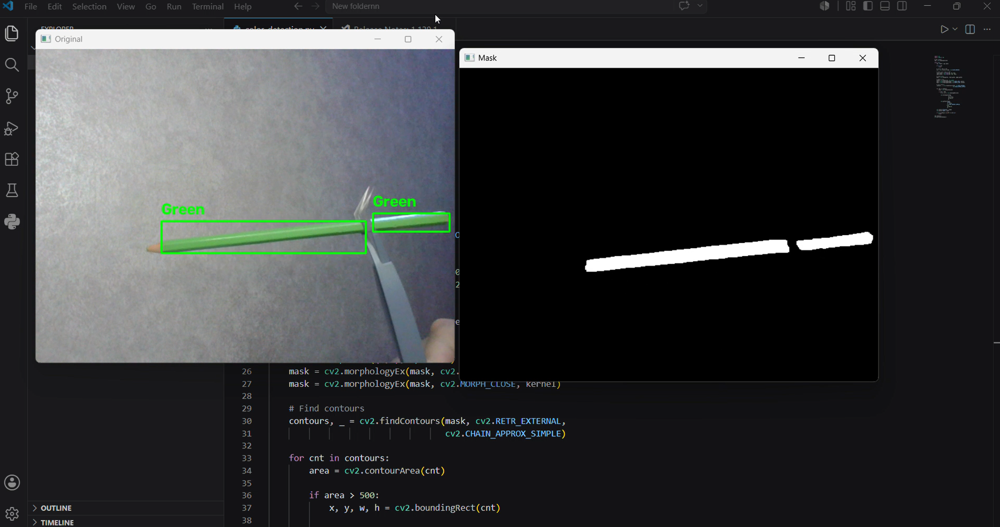
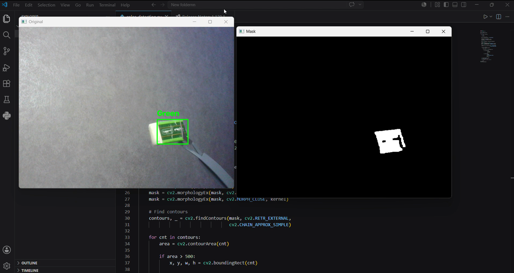

#  Green Color Detection using Python and OpenCV (HSV Color Space)

##  Project Overview

This project demonstrates real-time **green color detection** using **Python and OpenCV**. The program captures video from a webcam and detects green-colored objects using the **HSV (Hue, Saturation, Value) color space**.

The captured frames are converted from **BGR to HSV**, then a color mask is created to isolate the green color. The system uses contour detection to identify the detected object and draws a bounding box with the label **"Green"** around it.

**OpenCV and NumPy were installed using Anaconda, and the project was developed and executed using Visual Studio Code.**

---

##  Project Objectives

- Detect green-colored objects in real time using a webcam.
- Understand the use of HSV color space for color segmentation.
- Apply image masking to isolate a specific color.
- Detect object boundaries using contours.
- Gain practical experience in computer vision using Python and OpenCV.

---

## Repository Structure

* `color_detection.py` - The main Python script for real-time color detection.
* `obj1.png` - Test image for Object 1 detection result.
* `obj2.png` - Test image for Object 2 detection result.
* `green colour detection vid (1).mp4` - Video demonstration of the project.
* `README.md` - Project documentation.

---

##  Tools and Technologies

- Python
- OpenCV
- NumPy
- Anaconda
- Visual Studio Code
- Webcam

---

##  How It Works

1. Open the webcam using OpenCV.
2. Capture video frames continuously.
3. Convert each frame from **BGR color space to HSV color space**.
4. Define the HSV range for detecting the green color.
5. Create a mask that separates green pixels from the background.
6. Apply morphological operations to remove noise and improve the mask.
7. Detect contours of the green object.
8. Calculate the object area and ignore small unwanted regions.
9. Draw a bounding rectangle around the detected object.
10. Display the detected color label **"Green"** on the video frame.

---

##  Test Results

The program was tested using **two different green objects** to verify the accuracy of the detection process.

### Object 1

### Object 2

---

##  Demonstration

A short video demonstrating the real-time detection of green objects using the webcam is included in this repository.

https://github.com/user-attachments/assets/green%20colour%20detection%20vid%20(1).mp4

> **Note:** You can also view or download the demonstration video file directly from the repository: [`green colour detection vid (1).mp4`](./green%20colour%20detection%20vid%20(1).mp4)

---

---

##  Skills and Experience Gained

- Using Python for computer vision applications.
- Working with OpenCV functions for image processing.
- Understanding HSV color space and color thresholding.
- Creating and applying image masks.
- Using morphological operations to reduce noise.
- Detecting objects using contours.
- Managing Python libraries using Anaconda.
- Developing and running Python projects using Visual Studio Code.

---

##  Conclusion

This project demonstrates a simple real-time color detection system using Python and OpenCV. By applying HSV color segmentation, the program can detect and highlight green objects from a webcam stream, making it a useful introduction to computer vision techniques.
